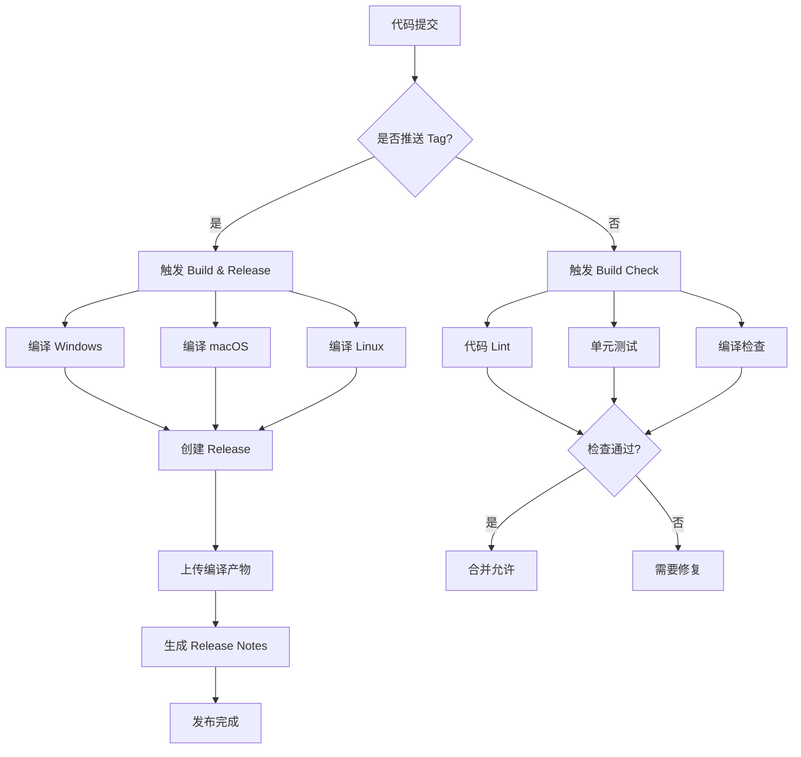

# GitHub Actions 自动编译配置

本项目使用 GitHub Actions 实现跨平台自动编译和发布。

## 📁 Workflow 文件

### 1. `build-release.yml` - 发布构建

**触发条件**：
- 推送 tag（格式：`v*`，如 `v1.0.0`）
- 手动触发（workflow_dispatch）

**构建平台**：
- ✅ Windows AMD64 (`.exe`)
- ✅ macOS Universal (Intel + Apple Silicon, `.app`)
- ✅ Linux AMD64 (可执行文件)

**自动操作**：
1. 跨平台编译 Wails 应用
2. 创建 GitHub Release
3. 上传编译产物
4. 生成 Release Notes

---

### 2. `build-check.yml` - 编译检查

**触发条件**：
- Push 到 `main` 或 `develop` 分支
- Pull Request 到 `main` 或 `develop` 分支
- 修改了 Go 文件、`go.mod`、`go.sum` 或 `cmd`、`internal` 目录

**检查项**：
- ✅ 代码 Lint（golangci-lint）
- ✅ 单元测试
- ✅ 跨平台编译检查（Windows、macOS、Linux）
- ✅ 代码覆盖率上传（Codecov）

---

## 🚀 使用指南

### 创建新版本发布

#### 方法 1：通过 Git Tag（推荐）

```bash
# 1. 确保代码已提交
git add .
git commit -m "准备发布 v1.0.0"
git push

# 2. 创建并推送 tag
git tag -a v1.0.0 -m "Release version 1.0.0"
git push origin v1.0.0

# 3. GitHub Actions 自动触发编译和发布
# 访问 https://github.com/Weini-Securenet-LLC/weini-quantum-proxy/actions 查看进度
```

#### 方法 2：通过 GitHub 网页界面

1. 访问：https://github.com/Weini-Securenet-LLC/weini-quantum-proxy/releases
2. 点击 "Draft a new release"
3. 点击 "Choose a tag" → 输入新 tag（如 `v1.0.0`）→ "Create new tag"
4. 填写 Release 标题和描述
5. 点击 "Publish release"
6. GitHub Actions 自动触发编译

#### 方法 3：手动触发

1. 访问：https://github.com/Weini-Securenet-LLC/weini-quantum-proxy/actions
2. 选择 "Build and Release" workflow
3. 点击 "Run workflow"
4. 选择分支，点击 "Run workflow"

---

### 版本号规范

遵循 [Semantic Versioning](https://semver.org/)：

```
v<MAJOR>.<MINOR>.<PATCH>[-<PRERELEASE>]

示例：
v1.0.0        - 正式版本
v1.0.1        - 补丁版本
v1.1.0        - 新功能版本
v2.0.0        - 重大更新版本
v1.0.0-beta   - Beta 测试版
v1.0.0-rc.1   - Release Candidate
```

**规则**：
- **MAJOR**: 重大变更，不兼容的 API 修改
- **MINOR**: 新功能，向后兼容
- **PATCH**: Bug 修复，向后兼容
- **PRERELEASE**: 预发布标识（beta、alpha、rc）

---

## 📦 编译产物

### 文件命名

- Windows: `weini-quantum-proxy-windows-amd64.exe`
- macOS: `weini-quantum-proxy-macos-universal.zip` (包含 .app)
- Linux: `weini-quantum-proxy-linux-amd64`

### 下载位置

发布后可在以下位置下载：
```
https://github.com/Weini-Securenet-LLC/weini-quantum-proxy/releases/latest
```

---

## 🔧 本地构建（开发环境）

如果需要在本地构建：

### 前置条件

#### 所有平台
```bash
# 1. 安装 Go 1.22+
# https://go.dev/dl/

# 2. 安装 Node.js 20+
# https://nodejs.org/

# 3. 安装 Wails CLI
go install github.com/wailsapp/wails/v2/cmd/wails@latest
```

#### Linux 额外依赖
```bash
sudo apt-get update
sudo apt-get install -y \
  libgtk-3-dev \
  libwebkit2gtk-4.0-dev \
  build-essential \
  pkg-config
```

#### macOS 额外依赖
```bash
# 安装 Xcode Command Line Tools
xcode-select --install
```

### 构建命令

#### 使用 Makefile（推荐）
```bash
# 安装依赖
make install-deps

# 构建所有平台
make build

# 只构建当前平台
make build-windows   # Windows
make build-linux     # Linux
make build-darwin    # macOS

# 开发模式（热重载）
make dev

# 运行测试
make test

# 代码检查
make lint
```

#### 使用 Wails CLI
```bash
cd cmd/proxy-node-studio-wails

# 开发模式
wails dev

# 构建当前平台
wails build -clean

# 构建指定平台
wails build -clean -platform windows/amd64
wails build -clean -platform linux/amd64
wails build -clean -platform darwin/universal
```

---

## 🐛 故障排除

### 问题 1：GitHub Actions 编译失败

**检查清单**：
- [ ] `go.mod` 和 `go.sum` 是否最新？
- [ ] Wails 版本是否兼容？
- [ ] 是否有语法错误？

**查看日志**：
```
访问：https://github.com/Weini-Securenet-LLC/weini-quantum-proxy/actions
点击失败的 workflow → 查看详细日志
```

---

### 问题 2：Release 未自动创建

**可能原因**：
1. Tag 格式不正确（必须以 `v` 开头）
2. Tag 未推送到远程：`git push origin v1.0.0`
3. GitHub Token 权限不足

**解决方案**：
```bash
# 检查 tag 是否推送
git ls-remote --tags origin

# 重新推送 tag
git push origin v1.0.0 --force
```

---

### 问题 3：macOS 构建失败

**可能原因**：
- 需要 Xcode Command Line Tools
- 需要 CGO_ENABLED=1

**解决方案**：
在 macOS 上本地构建前，确保：
```bash
xcode-select --install
export CGO_ENABLED=1
```

---

### 问题 4：Linux 构建缺少依赖

**错误信息**：
```
Package gtk+-3.0 was not found
```

**解决方案**：
```bash
sudo apt-get update
sudo apt-get install -y \
  libgtk-3-dev \
  libwebkit2gtk-4.0-dev \
  build-essential \
  pkg-config
```

---

## 📊 构建状态

在项目 README 中添加构建状态徽章：

```markdown
[](https://github.com/Weini-Securenet-LLC/weini-quantum-proxy/actions/workflows/build-release.yml)
[](https://github.com/Weini-Securenet-LLC/weini-quantum-proxy/actions/workflows/build-check.yml)
```

---

## 🔄 工作流程图



---

## 📝 最佳实践

### 1. 发版前检查

```bash
# 1. 运行测试
make test

# 2. 代码检查
make lint

# 3. 本地构建测试
make build-linux  # 或其他平台

# 4. 更新 CHANGELOG.md
vim CHANGELOG.md

# 5. 提交并推送
git add .
git commit -m "Release v1.0.0"
git push

# 6. 创建 tag
git tag -a v1.0.0 -m "Release version 1.0.0"
git push origin v1.0.0
```

### 2. 版本迭代建议

```
v0.9.0 (Beta)     → 测试版
v0.9.1 (Beta)     → Bug 修复
v1.0.0 (Stable)   → 正式版
v1.0.1 (Stable)   → 紧急修复
v1.1.0 (Stable)   → 新功能
v2.0.0 (Major)    → 重大更新
```

### 3. Release Notes 编写

每次发布时，在 `CHANGELOG.md` 中记录：

```markdown
## [1.0.0] - 2026-05-01

### Added
- 新功能 A
- 新功能 B

### Changed
- 改进 X
- 优化 Y

### Fixed
- 修复 Bug #123
- 修复 Bug #456

### Security
- 安全更新 Z
```

---

## 🆘 获取帮助

- 📖 Wails 文档: https://wails.io/docs/
- 📖 GitHub Actions 文档: https://docs.github.com/actions
- 💬 GitHub Issues: https://github.com/Weini-Securenet-LLC/weini-quantum-proxy/issues
- 📧 Email: info@weinisecure.net

---

**最后更新**: 2026-05-01  
**状态**: ✅ 生产就绪
